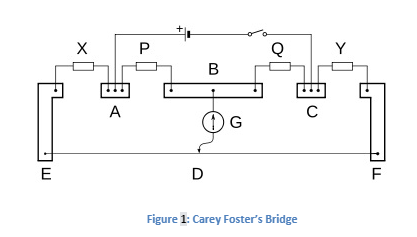

## Introduction (Round 0)

<b>Discipline | <b>Physical Sciences
:--|:--|
<b> Lab | <b> Basics of Physics
<b> Experiment|     <b> 1. Carey Foster's Bridge to Measure Specific Resistance of Material

<h5> About the Experiment : </h5>  

The Carey Foster's bridge is as in the figure1. One meter long wire of manganin or constantan of uniform cross-section area is stretched along a meter scale. The wire is connected at both the ends with copper strips. Beside these strips there is one copper strip B fixed parallel to the meter scale and two L-shaped strips A and C at the ends of the scale. In between these strips there are four empty spaces AB, CD, EF and GH. In first empty space AB known resistance X, in second empty space CD a resistance P, in third empty space a resistance Q and in fourth empty space GH the known resistance Y is connected. The Leclanche cell E and plug key K are connected in between A and C. Between the points B and D, galvanometer G is connected. At point D, contact key is fixed which can move here and there on the wire EF. This key is known as jockey. On pressing jockey, point D gets connected with the galvanometer otherwise not.

<b>Name of Developer | <b> Prof Kantesh Balani
:--|:--|
<b> Institute | <b> IIT Kanpur
<b> Email id|     <b> kbalani@gmail.com
<b> Department | Material Science and Engineering

#### Contributors List

SrNo | Name | Faculty or Student | Department| Institute | Email id
:--|:--|:--|:--|:--|:--|
1 | Dr. Ashutosh Tiwari | Faculty | Physics | REC Banda | ashutosh.tiwari@recbanda.ac.in
2 | Abhay Gupta | Student | Information Technology | REC, Banda |abhaypc26@gmail.com
3 | Praphull Maurya | Student | Information Technology | REC, Banda |praphullmaurya123@gmail.com
4 | Satish Kumar | Student | Information Technology | REC, Banda |satishkumar7991@gmail.com
5 | Mohitendra Damailiya | Student | Information Technology | REC, Banda |mohitendra.mpsd@gmail.com
6 | Narendra Rajpoot | Student | Information Technology | REC, Banda |nrajpoot1146@gmail.com

