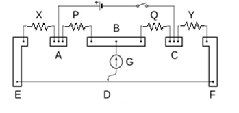

## <b> Pre-test
#### Please attempt the following questions

1) The principle on which the Carey Foster Bridge experiment based is? 
<b>a) Wheat Stone Bridge </b>
b)Cyclotron 
c) EM Waves 
d) Hartley Oscillator  

2) In Carey Foster Bridge experiment the galvanometer G is connected across branch  
a) AB 
<b>b)BD </b>
c)  AC 
d) BC 

3)Length of the wire on which Jockey is slided is: 
a) 80 cm 	b) 100 cm 	c) 90 cm 	d) 50 cm

