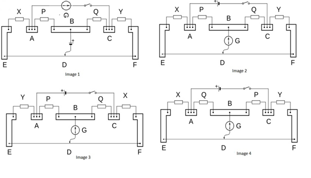
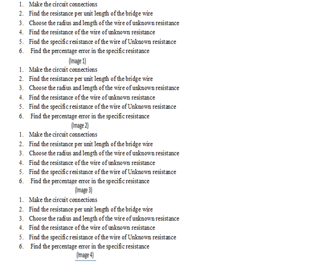

## Pedagogy (Round 1)

 
<b> Experiment: Carey Foster’s Bridge to Measure Specific Resistance of Material    

<b>Discipline | <b>Physical Sciences
:--|:--|
<b> Lab | <b> Basics of Physics
<b> Experiment|     <b> 1. Carey Foster’s Bridge to Measure Specific Resistance of Material

<h4> [1. Focus Area](#LO)
<h4> [2. Learning Objectives ](#LO)
<h4> [3. Instructional Strategy](#IS)
<h4> [4. Task & Assessment Questions](#AQ)
<h4> [5. Simulator Interactions](#SI)

#### 1. Focus Area : Reinforce theoretical concept

#### 2. Learning Objectives and Cognitive Level

Sr. No |	Learning Objective	| Cognitive Level | Action Verb
:--|:--|:--|:-:
1.| Student will be able to  identify the principle of Carey Foster’s Bridge. | Recall | Identify
2.| Student will be able to  describe the methodology to vary the resistance of the resistance box and to observe the variation in balancing length of the bridge wire. | Understand | Describe
3.| Student will be able to predict the resistance of the unknown wire by using the resistance per unit length calculated, the balancing length of the wire and the resistance of the resistance box. | Apply | Predict
4.| Student will be able to  Examine the radius and length of the unknown wire and calculate the value of specific resistance of the material of the wire. | Analyse | Examine
5.| Student will be able to  Conclude the specific resistance and to calculate the percentage error with the standard value	 | Evaluate | Conclude

 

    <b><a href="#top">↥ back to top</a></b>

 

#### 3. Instructional Strategy  
###### Name of Instructional Strategy  :    <u> Expository Method
###### Assessment Method: Summative

<u> <b>Description: </b> of how you are going to implement the above Instructional Strategy in your Simulator: </u>
 
 Bt providing student experimental setup in simualator, student can easily verify the law and can verify by taking multiple observation.

 

    <b><a href="#top">↥ back to top</a></b>

 

#### 4. Task & Assessment Questions:

Read the theory and comprehend the concepts related to the experiment. [LO1, LO2, LO3]
 

Sr. No |	Learning Objective	| Task to be performed by   the student  in the simulator | Assessment Questions as per LO & Task
:--|:--|:--|:-:
1.| Student will identify the principle of Carey Foster’s Bridge. | Student will complete introduction. He will be given 4 images for the arrangement of Carey Foster’s Bridge and will choose correct image from them. | The correct image for the arrangement of Carey Foster’s Bridge is:  a) Image 1 b)Image 2 c)Image 3 d)Image 4
2.| To enable the student to describe the methodology to vary the resistance of the resistance box and to observe the variation in balancing length of the bridge wire. | Student will be given 4 images for the correct procedure to be followed in the experiment. He will choose correct image from them. | Choose the image which shows the correct order of the procedure to be followed in this experiment:  a)Image 1 b) Image 2   c) Image 3  d) Image 4
3.| Student will be able to Predict the resistance of the unknown wire by using the resistance per unit length calculated the balancing length of the wire and the resistance of the resistance box. | Student will make circuit connections followed by taking observations for balancing length l1 and l2 corresponding to the resistance of the resistance box. Student will also enter these lengths in table 1 and table 2 and the value of unknown resistance will be calculated. | The value of the balancing length l1 when the unknown resistance is connected across AB and a resistance of 5 ohms is taken out from the resistance box:   a) 48.0 cm   b) 49.0 cm c) 47.0 cm d) 46.0 cm
4.| Student will examine the radius and length of the unknown wire and calculate the value of specific resistance of the material of the wire. | Student will choose the radius and length of the unknown wire and will use the value of the unknown resistance calculated from the table 2, to calculate the value of specific resistance of the material of unknown wire.| Specific resistance of manganin wire is of the following order. a) 4.33 x10-5 Ohm.cm b) 4.33 x10-7 Ohm.cm  c) 4.33 x10-9 Ohm.cm  d) 4.33 x10-5 Ohm.m
5.| Conclude the specific resistance and to calculate the percentage error with the standard value. | Students will compare the value of the specific resistance of the material of the wire calculated with the standard value to calculate the percentage error occurred in the observation. | On increasing the radius of the wire the specific resistance of the material of the wire: a) Increases b) decreases c) remains constant d) NOT

You can add more question. All questions may not be as MCQ
Please add the correct answer as well.
or type the correct answer below the question.

  

 <u> You can add additional TASKS & Assessment Questions <u>
 

    <b><a href="#top">↥ back to top</a></b>

 

#### 4. Simulator Interactions:
 

Sr.No | What Students will do? |	What Simulator will do?	| Purpose of the task
:--|:--|:--|:--:
1.| Simulator will allow student to make connections and will alert him in case of wrong connections made. | Student will slide the power button of the simulator to ON position and will set the Potential difference applied to the PN junction.  | To initiate the simulator
2.| Simulator will show the green light indicating that the simulator is ready for use.  | Student will choose the desired temperature from the heater and gradually increase the temperature  | To find the current in the PN Junction diode corresponding to the temperature of the Junction.
3.| Simulator will show the corresponding current in the micro-ammeter  | Student will insert the current corresponding to each temperature of the PN junction and mention these values in the table.  | To get the 103 /T and log10Is values with respect to the changing temperature of the junction.
4.| Simulator will calculate 103 /T and log10Is values corresponding to each current value entered in the Table. | Student will press the draw Graph button   | To plot graph between 103 /T and log10Is
5.| Simulator will show plot between 103 /T and log10Is | Student will choose any two points on the graph and press the calculate slope button  | Student will note the value of the slope and calculate the energy band gap value for a given PN junction and will also calculate the percentage error with the standard value.
6.| Slope of the graph will be calculated. | Student will change the potential difference applied and will repeat the experiment  | Student will again note the value of the slope and calculate the energy band gap value for a given PN junction and will also calculate the percentage error with the standard value.
